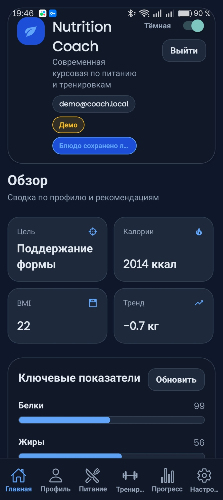
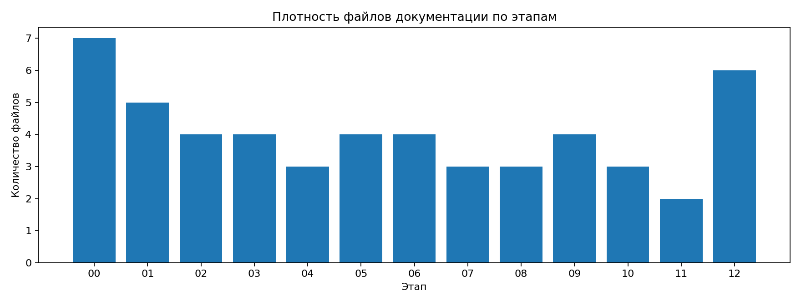
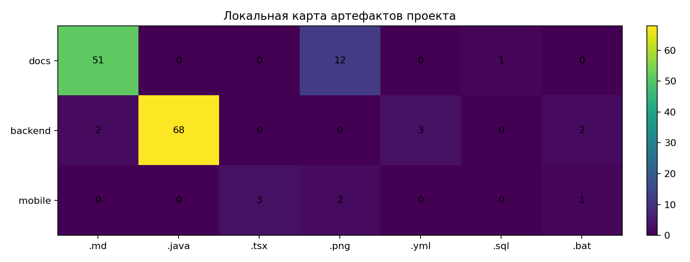

# Nutrition Coach

## О проекте

**Nutrition Coach** — мобильное приложение для подбора питания, тренировок и отслеживания прогресса пользователя.  
Проект выполнен как курсовая работа по мобильной разработке с серверной частью на Spring Boot и мобильным клиентом на React Native + Expo.

Приложение позволяет:

- регистрироваться и авторизовываться через JWT;
- работать с ролями `USER` и `ADMIN`;
- просматривать, создавать, редактировать и удалять блюда;
- просматривать, создавать, редактировать и удалять тренировки;
- отслеживать прогресс и историю изменений;
- использовать светлую и тёмную тему;
- работать с локальным кэшированием для частичной оффлайн-доступности;
- взаимодействовать с REST API backend-сервера.

---

## Используемый стек технологий

### Mobile
- React Native
- Expo
- TypeScript
- Axios
- AsyncStorage
- React Navigation
- Context API

### Backend
- Java 21
- Spring Boot 3.4.x
- Spring Security
- Spring Data JPA
- JWT Authentication
- PostgreSQL
- H2 Database dependencies
- Maven
- Swagger / OpenAPI
- JaCoCo
- JUnit 5
- Mockito

---

## Ключевые факты о репозитории

| Показатель | Значение |
|---|---:|
| Java-файлы | 68 |
| TypeScript/TSX-файлы | 3 |
| Markdown-файлы | 54 |
| PNG-изображения | 14 |
| Тестовые классы | 9 |
| Контроллеры | 10 |
| Сервисы | 9 |
| Репозитории | 5 |
| REST-эндпоинты | 27 |
| Разделы документации в `docs/` | 13 |

---

## Структура проекта

```text
course_project_Blinov/
├── backend/          # Spring Boot backend
├── mobile/           # React Native / Expo приложение
├── docs/             # Вся проектная документация
├── docker-compose.yml
├── README.md
└── LICENSE           # файл лицензии MIT
```

---

## Архитектура (PCMEF)

Проект организован в клиент-серверной архитектуре с разделением backend по слоям.  
Для описания структуры используется модель **PCMEF (Presentation-Control-Mediator-Entity-Foundation)**.

| Слой | Расположение в проекте | Ответственность |
|---|---|---|
| Presentation (P) | `mobile/` | Интерфейс пользователя, экраны, навигация, ввод данных |
| Control (C) | `backend/.../controller` | REST API, обработка запросов, валидация DTO, точки входа |
| Mediator (M) | `backend/.../service` | Бизнес-логика, сценарии работы, транзакции |
| Entity (E) | `backend/.../entity` | JPA-сущности и доменные объекты |
| Foundation (F) | `backend/.../repository`, `backend/.../config` | Доступ к БД, конфигурация, безопасность, инициализация |

---

## Скриншоты и схемы

### Интерфейс приложения


### Диаграммы
- [Контекстная диаграмма](docs/images/Контекстная_диаграмма.png)
- [Use Case диаграмма](docs/images/Use_case_диаграмма.png)
- [ER-диаграмма](docs/images/ER-диаграмма.png)
- [PCMEF-диаграмма](docs/images/PCMEF-диаграмма.png)
- [Диаграмма классов проектирования](docs/images/Диаграмма_классов_проектирования.png)

---

## Статистика разработки и оформления

### Краткая сводка по проекту
- backend: Spring Boot 3.4.x, Java 21, JWT, OpenAPI/Swagger, JUnit/JaCoCo;
- mobile: React Native/Expo + TypeScript;
- документация: 13 разделов в папке docs/;
- проектные артефакты: passport, BUC, use-case, architecture, ERD, sequence diagrams, user/admin guides;
- тесты: реализованы и запускаются в автоматическом режиме.

### Текстовые метрики
- 10 backend-контроллеров;
- 27 REST-эндпоинтов;
- 9 сервисных классов;
- 5 репозиториев;
- 9 тестовых классов;
- 12+ документационных разделов;
- отдельные материалы по тестированию, рефакторингу, API, UI, развёртыванию и руководствам пользователя.

### Графики




---

## REST API

Backend предоставляет REST API, которое используется мобильным приложением.

### Основные группы эндпоинтов
- `POST /api/auth/register`
- `POST /api/auth/login`
- `GET /api/profile/me`
- `PUT /api/profile/me`
- `GET /api/dashboard/summary`
- `GET /api/nutrition/plan`
- `GET /api/workouts/plan`
- `GET /api/meals`
- `GET /api/meals/{id}`
- `POST /api/meals`
- `PUT /api/meals/{id}`
- `DELETE /api/meals/{id}`
- `GET /api/workout-plans`
- `POST /api/workout-plans`
- `GET /api/progress`
- `POST /api/progress`
- `GET /api/admin/users`

### Документация API
Swagger UI доступен в backend-проекте через OpenAPI-конфигурацию.

---

## Документация

- [Паспорт проекта](docs/00-project-charter/project-charter.md)
- [Контекстная диаграмма](docs/00-project-charter/context-diagram.md)
- [BUC](docs/00-project-charter/buc-diagram.md)
- [Глоссарий](docs/00-project-charter/glossary.md)
- [Use Case Specifications](docs/01-requirements/use-case-specifications.md)
- [Техническое задание](docs/01-requirements/technical-specification.md)
- [Архитектура](docs/02-architecture/README.md)
- [База данных](docs/03-database/README.md)
- [Детальное проектирование](docs/04-detailed-design/README.md)
- [Тестирование](docs/06-testing/README.md)
- [Рефакторинг](docs/07-refactoring/README.md)
- [UI](docs/08-ui/README.md)
- [API](docs/09-api/README.md)
- [Развёртывание](docs/10-deployment/README.md)
- [Руководство пользователя](docs/11-user-guide/README.md)
- [Итоговый отчёт](docs/12-final-report/README.md)
