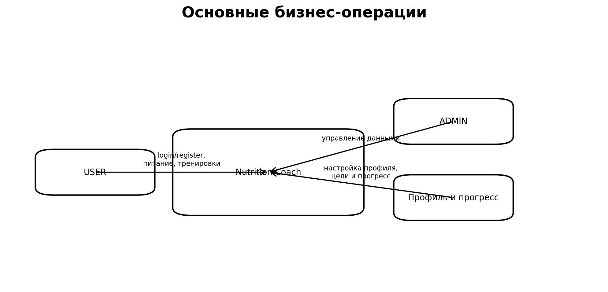

# BUC-диаграмма

## Основные сценарии
- регистрация и вход;
- просмотр профиля и рекомендаций;
- управление блюдами;
- управление тренировками;
- запись прогресса;
- администрирование данных;
- переключение темы и работа в offline-режиме.
