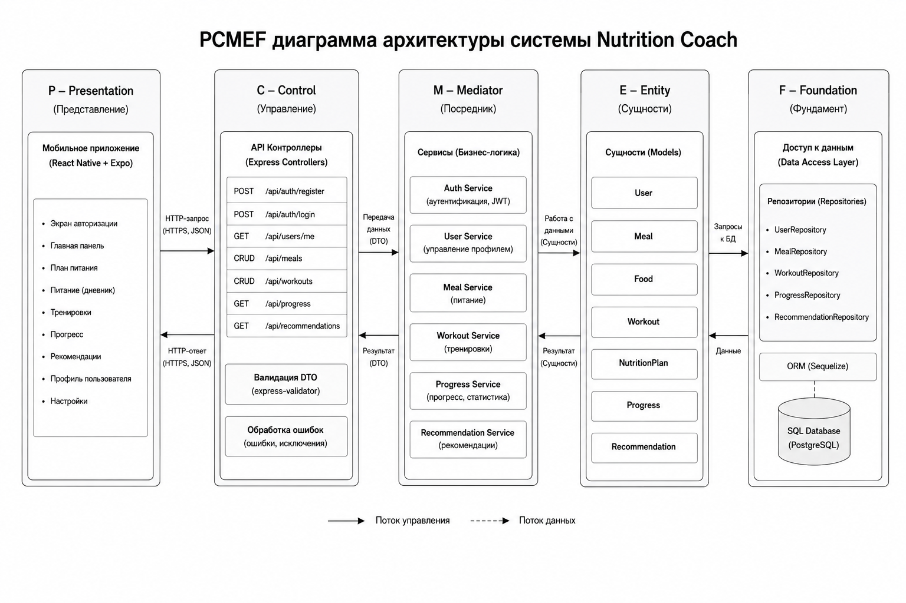

# PCMEF / Component Diagram

## Пояснение
Диаграмма показывает, как UI-слой мобильного приложения взаимодействует с контекстом, API-клиентом и backend-сервисами.

## Ключевые зависимости
- UI получает состояние через `AppContext`;
- API-слой использует Axios;
- backend обрабатывает запросы через controller/service/repository;
- PostgreSQL хранит сущности домена.
