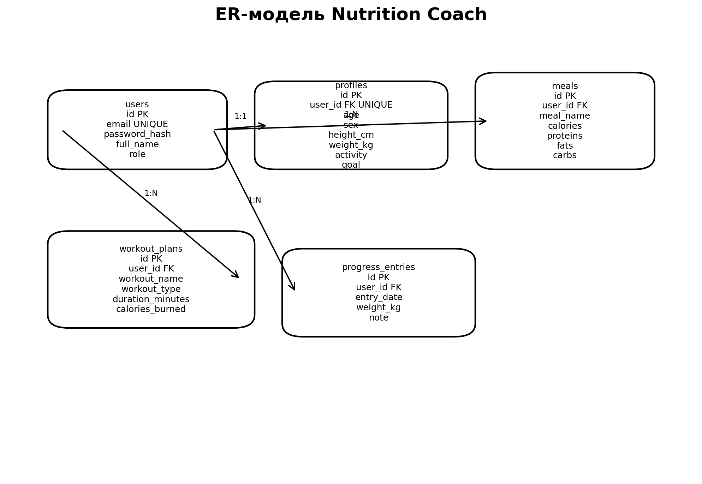

# ER Diagram

## Сущности
- `users`
- `profiles`
- `meals`
- `workout_plans`
- `progress_entries`

## Связи
- `users` 1:1 `profiles`
- `users` 1:N `meals`
- `users` 1:N `workout_plans`
- `users` 1:N `progress_entries`
