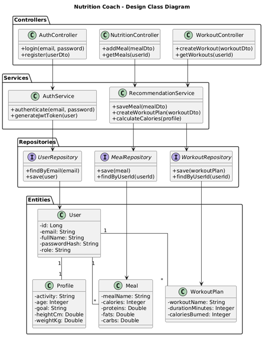

# Диаграмма классов проектирования

## Основные узлы структуры
- контроллеры принимают HTTP-запросы;
- сервисы реализуют сценарии;
- репозитории обращаются к БД;
- DTO отделяют транспортный слой от доменных сущностей;
- mapper-классы преобразуют сущности в ответы и обратно.

## Вывод
Диаграмма классов проектирования показывает, что код построен по слоистой схеме и не смешивает работу UI, бизнес-логики и доступа к данным.
