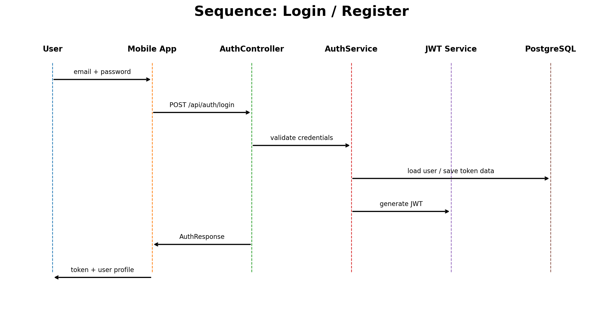

# Sequence Diagrams

## 1. Авторизация

## 2. CRUD-операции

## Описание
Сценарии показывают стандартный поток:
- пользователь действует в UI;
- приложение отправляет запрос на backend;
- backend проверяет данные и сохраняет их в БД;
- UI обновляется после ответа сервера.
