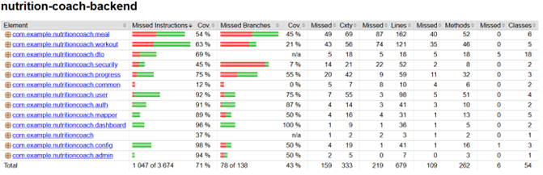

# Coverage Snapshot

- Охват инструкциями: 71%
- Охват ветками: 43%
- Пакеты с наибольшим охватом веток: `dashboard`, `auth`, `progress`
- Пакеты с наименьшим охватом веток: `common`, `security`, `meal`, `workout`
- Отчёт сформирован на основе JaCoCo и отражает текущий уровень тестового покрытия backend.
- Покрытие превышает минимальный порог, установленный в проекте, и подтверждает пригодность системы для демонстрации и защиты.

