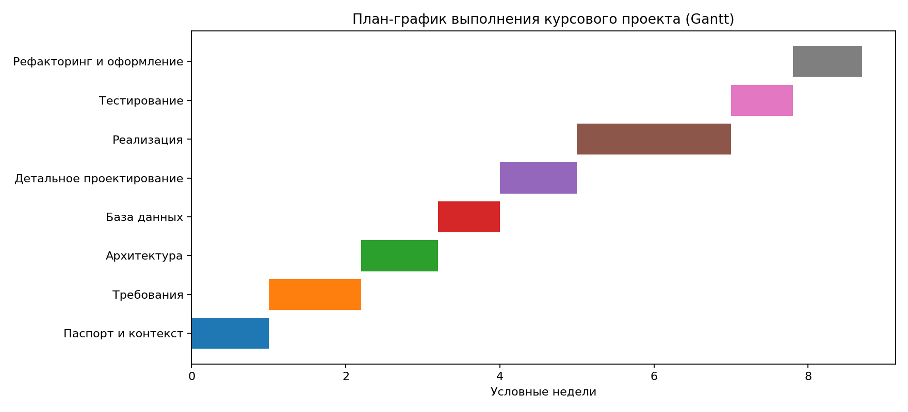

# План-график (Gantt)

## Этапы
- паспорт и контекст;
- требования;
- архитектура;
- база данных;
- детальное проектирование;
- реализация;
- тестирование;
- рефакторинг и оформление.

## Назначение
Диаграмма помогает показать последовательность подготовки проектных артефактов и логичное движение от анализа к финальной сдаче.
